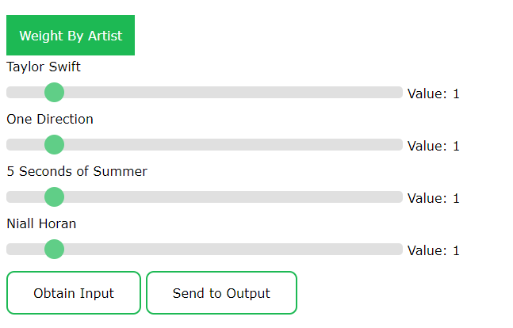

# spotify-weighted-playlists-web
Web app that allows you to generate shuffled playlists where different artists have custom weightings. Requires an empty output playlist (current contents will be overwritten) that is filled as a result of the shuffle and can be listened to in order. Try it out [here](https://zanderson004.github.io/spotify-weighted-playlists-web/).

Instructions:
1. Click 'Get Access Token and sign in to Spotify.
2. Paste input and output Spotify playlist URLs in the respective fields and press 'Submit'.
3. Click 'Obtain Input'.
4. Click on the 'Weight by Artist' tab.
5. Adjust the weightings of the primary artists. An artist with double the weight of another is two times more likely to appear next.
6. Click 'Send to Output'.

